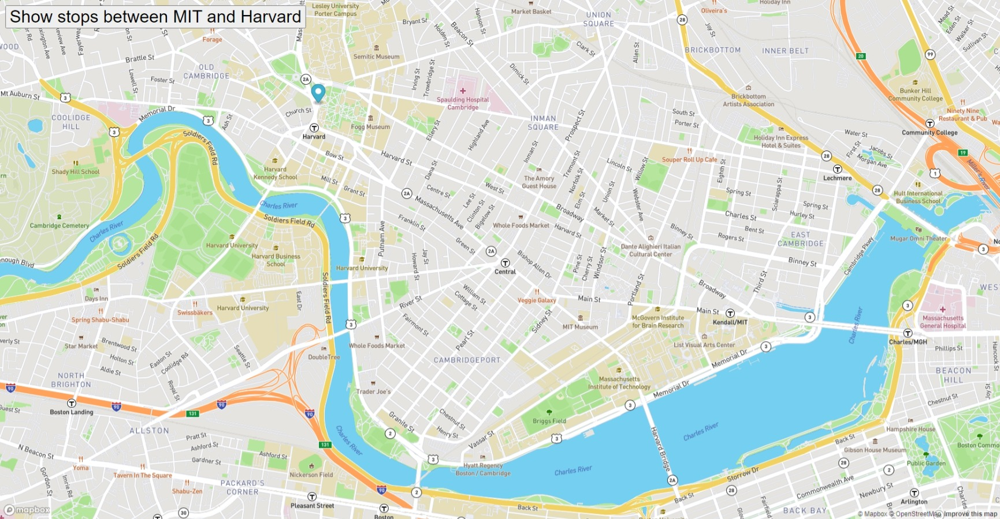

# Real-Time-Bus-Tracker

## Description
Hello, in this assignment, i used the MBTA bus data to determine stops between Harvard and MIT. Then, i added an animated marker on the map to highlight the bus routes. So now when i click in the stops etween Harvard and MIT it will show me all the stops in that route.

## How to run
1.1. Fork the repository.
2. Clone the repository.
3. Install the dependencies by running npm install.
4. Run the project using npm start.
5. Open the project in your browser at http://localhost:3000.

## License
This project is licensed under the MIT License - see the LICENSE file for details.
